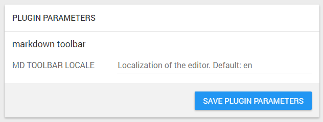
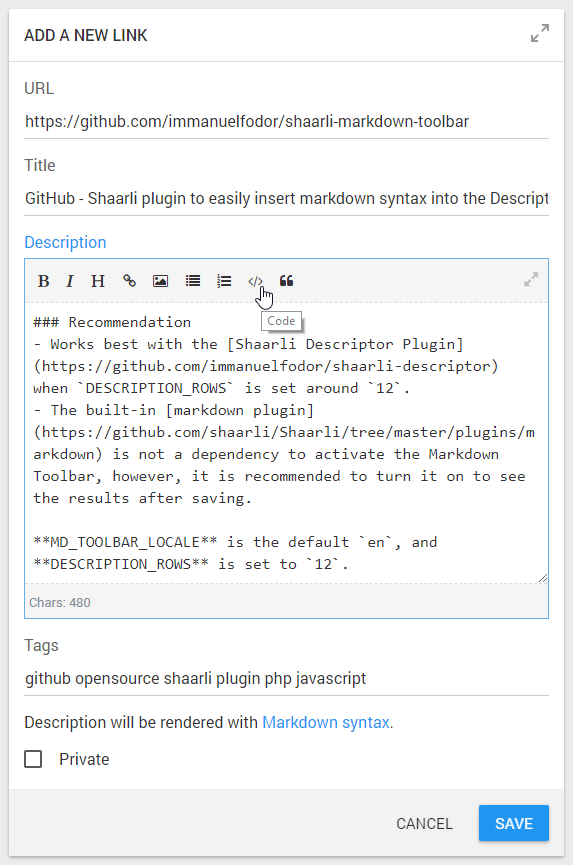
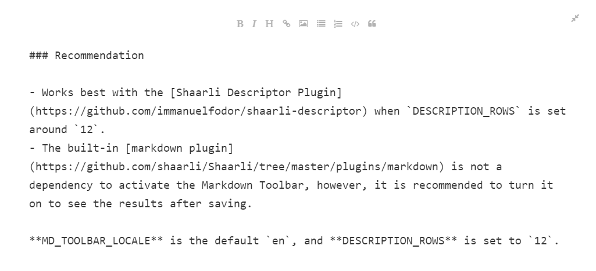

# Shaarli Markdown Toolbar Plugin 

[Shaarli](https://github.com/shaarli/Shaarli) plugin to easily insert markdown syntax into the **Description** field when editing a link

Tested on Shaarli 0.9.2 with the [Shaarli-Material](https://github.com/kalvn/Shaarli-Material) and the built-in [default](https://github.com/shaarli/Shaarli/tree/master/tpl/default) themes using desktop and Android Chrome browsers.

## Features

* Adds a markdown editor toolbar to the Description field when adding or editing a link
* Supports distraction-free writing in fullscreen mode
* Works well on both desktop and mobile
* The editor has built-in translations for 23 locales
* Plugin Administration page integration for easy configuration
* All plugin dependencies are included in the local setup to respect privacy and do not leak [HTTP referrer](https://portswigger.net/kb/issues/00500400_crossdomainrefererleakage). Existing licenses are distributed with the included files. See the *Credits* seciton for attribution.

## Screenshots

### Plugin Administration page

After plugin enabled with default `MD_TOOLBAR_LOCALE` settings:



### Edit Link page

After plugin enabled and the [Shaarli Descriptor Plugin](https://github.com/immanuelfodor/shaarli-descriptor)'s `DESCRIPTION_ROWS` parameter is set to `12` to have more space in the editor area:



### Fullscreen mode

Distraction-free writing can be enabled by clicking on the fullscreen button while editing a link:



## Usage

* Select some text and click on any of the toolbar buttons to apply formatting.
* If you click one of the buttons without previous selection, you get a corresponding default text with the desired formatting applied to it. The selection is then applied to the default text for quick replacement.
* The plugin has built-in translations in 23 languages for the toolbar buttons and default texts. See the *Configuration* section here on this page for further info how to enable localization.
* Works best with the [Shaarli Descriptor Plugin](https://github.com/immanuelfodor/shaarli-descriptor) when `DESCRIPTION_ROWS` is set around `12`.
* The built-in [markdown plugin](https://github.com/shaarli/Shaarli/tree/master/plugins/markdown) is not a prerequisite to activate the Markdown Toolbar, however, it is recommended to turn it on to see the formatted results after saving.

## Installation

The plugin's folder (`markdown_toolbar`) should be placed in the `<shaarli>/plugins/` directory.

The directory structure should look like:

```bash 
└── plugins
    └── markdown_toolbar
        ├── includes/...
        ├── markdown_toolbar.html
        ├── markdown_toolbar.meta
        └── markdown_toolbar.php
```

To enable the plugin, just check it in the Plugin Administration page (`?do=pluginadmin`).

You can also add `markdown_toolbar` to your list of enabled plugins in `data/config.json.php`.\
The `general.enabled_plugins` list should look like then:

```
"general": {
  "enabled_plugins": [
    "markdown_toolbar",
    [...]
  ],
}
```

## Configuration

Go to the Plugin Administration page, and edit the following settings (with the plugin enabled):

* **MD_TOOLBAR_LOCALE**\
*Localization of the editor. Default: en*\
Example value: `hu`\
Supported values: `en`, `ar`, `cs`, `da`, `de`, `fa`, `fr`, `hu`, `it`, `ja`, `kr`, `nb`, `nl`, `pl`, `ptBR`, `ru`, `sl`, `sv`, `tr`, `ua`, `zh-tw`, `zh`. If not specified or malformed, defaults to `en`.

> Note: this setting can also be set in `data/config.json.php`, in the `plugins` section:

```
"general": {
    "plugins": {
        "MD_TOOLBAR_LOCALE": "ja",
        [...]
    },
}
```

## Known issues

* There is a bug in Shaarli's `Router.php:L125-131`, hence there is no backend way to detect the difference between the `addlink` and the `edit_link` pages. Because of this issue, I needed to add `autofocus:true` to the editor generally when the page loads.
* When the built-in [vintage](https://github.com/shaarli/Shaarli/tree/master/tpl/vintage) theme is active, the editor works but has smaller issues (see below) that I am not going to fix right now. This theme does not have a CSS identifier that one can use to bind styles to it (such as the default theme has its `.pure-g` class).
    * The editor does not well fit the editlink form
    * The "exit fullscreen" button is positioned out of the screen 
    * The "enter fullscreen" button is misplaced on some mobile resolutions
* Any other issues that the [Bootstrap Markdown](https://github.com/toopay/bootstrap-markdown) editor has can be present here though I tried to fix some of them. That repo has not been updated for years, so I made all changes locally.

If you fix an issue from the list or some newly discovered one, please open a [pull request here](https://github.com/immanuelfodor/shaarli-markdown-toolbar/pulls).

## Credits

This project would not come to life without:

* jQuery: https://jquery.com/
* Bootstrap Markdown: https://github.com/toopay/bootstrap-markdown
* Bootstrap: https://github.com/twbs/bootstrap
* Font Awesome: https://github.com/FortAwesome/Font-Awesome

## Contact

Immánuel Fodor\
[fodor.it](https://fodor.it/shaarlimarkit) | [Linkedin](https://fodor.it/shaarlimarkin)